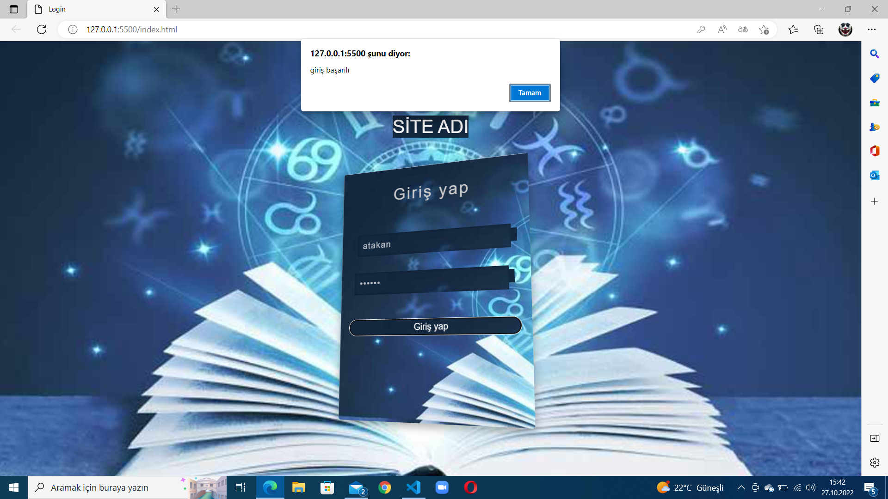

# Kullanıcı adı ve şifresi belli olan glassmorphism yapısında bir login sayfası
## Kullanıcı adı:
### atakan
## Şifre:
### 697845

##### Kullanıcı adı veya şifre hatalı olduğu zaman sayfa uyarı veriyor, kullanıcı adı ve şifre doğruysa sayfada giriş başarılı diye bir alert alıyorsunuz.

